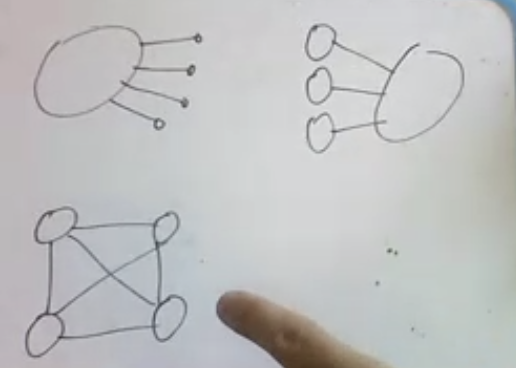

# Classification of hybrid event styles

## Summary

This document summarises the different types of hybrid events and maps them, with examples, onto a set of general characteristics. This will allow organisers to understand the options available to them and the characters of the events that particular combinations lead to, enabling them to choose an appropriate format for a specific planned event.

## Scope & definitions

Event
: Something which is bounded in time, with a clear start and end, between which participants are mainly focussing their attention on participating in that event.

  - Examples: conferences, workshops, focused training
  - Non-examples: undergrad courses, projects

Hybrid Event
: Something in which people can meaningfully participate and interact in either a face-to-face or remote setting, or a combination, during a single event. [Wikipedia definition](https://en.wikipedia.org/wiki/Hybrid_event)

### Features of a hybrid event

- Peer interaction:
    - Broadcast/didactic i.e. a presenter to an audience
    - Interactive smaller groups discussions
- Synchronicity:
    - Synchronous: everyone connects / engages at the same time
    - Asynchronous: aspects run at different times, depending on participant availability, etc 
- Facilitation & structure:
    - Highly structured: schedule planned and fixed in advance by organisers
    - Freeform: entire agenda and schedule determined during the event by participants
- Objectives:
    - Learning/knowledge exchange
    - Getting to know people (networking)
    - Co-creation (e.g. a hackathon)
    - Community-building
- Location / geographic distribution of audience
    - Node/pod size mean and variance; connectivity between nodes
    

#### Other varables

- Size: duration; number of participants
- Tooling types
- Types of interaction: video, voice, text, pictures/whiteboards, games

### Types of hybrid events

| Event Type | Objective | Interaction | Synchronicity | Geographic distribution | Examples |
| -------- | -------- | -------- | -------- | -------- | -------- |
| Traditional event with online elements (e.g. live streaming, remote presenters, Twitter walls/interaction)     | Knowledge dissemination, Networking | Low :arrow_down_small:   | High :arrow_up_small:    | Low :arrow_down_small:   | [Biodiversity_next](https://biodiversitynext.org)|
| Traditional event with recorded elements     | Knowledge dissemination | Low   :arrow_down_small:     | Low :arrow_down_small:       | High :arrow_up_small: | |
| Multi-site, single topic training | Knowledge dissemination | High :arrow_up_small: | High :arrow_up_small: | High :arrow_up_small: | Gallantries, [Carpentries instructor training](https://carpentries.github.io/instructor-training/) |
| Multi-site, multi-topic sprint | Community building, co-creation | High :arrow_up_small: | High :arrow_up_small: | High :arrow_up_small: | [Mozilla Global Sprint](https://mozilla.github.io/global-sprint/) |
| Hybrid un-conference | Networking, community building | High :arrow_up_small: | High :arrow_up_small: | Low :arrow_down_small:   | [NL-RSE meetup](https://nl-rse.org/events/2020-03-13-meetup.html)|
| Ask Me Anything | Knowledge dissemination | High :arrow_up_small: | Low :arrow_down_small: | High :arrow_up_small: | Reddit AMAs |
| Drop in / Help Session / Office Hours | Problem solving | Low :arrow_down_small:| Low :arrow_down_small:| Low :arrow_down_small:| |
| Webinar | Knowledge dissemination | Low :arrow_down_small:| High :arrow_up_small:| High :arrow_up_small: | [RDA Plenary 15](https://www.rd-alliance.org/plenaries/rda-15th-plenary-meeting-australia)|
| "Community Notice Board" / Hacky Hours | Co-working/social accountability | High :arrow_up_small:| Low :arrow_down_small:| Low :arrow_down_small:| [Queensland Hacky Hour](https://www.qcif.edu.au/index.php/events/hacky-hour)|

## Examples of hybrid events
* Events that require higher interaction:
    *  Collaborations Workshop (medium/)
    * [THE Port hackathon](https://theport.ch/): main hackathon is a 3 day in-person experience, but for 5-6 weeks before it teams meet online roughly once a week (medium/)
    * Carpentries community discussions (small/)
    * [NL-RSE meetup](https://docs.google.com/document/d/1SdZCzMeynDuyFfaERPNpDg14QEdYCO3zPyhBlcadJHc/edit#heading=h.843bj68sanxq) (small/)
    * British Library reading group: multiple attendees split between two rooms on different sites via built-in video conferencing facilitiy (medium/)
    * [Climate-KIC's Climathon](https://climathon.climate-kic.org/en/): Many cities around the world hosting climate-related hackathons (though not all around coding) all taking place within a few weeks and only loosely connected (large/)
    * [The Pan-european Quantum Internet Hackathon](https://indico.cern.ch/event/851369/): took place in many distrubted “nodes” around Europe all in late-October 2019 (large/ )
    * [Mozilla Global Sprint](https://mozilla.github.io/global-sprint/) (large/)
* Events that require less interaction 
    * [RDA Plenary 15](https://www.rd-alliance.org/plenaries/rda-15th-plenary-meeting-australia): moved from being an in-person event to being an online event where keynotes were streamed at the time where they originally planned, and group sessions took place online in an extended two week period, with varying timeslots to accomodate timezones, it also included remote poster session (large/)
* Events that require key few leads
    *  [Gallantries](https://galaxy-carpentries.github.io/gallantries/about) classes (up to 20) in multiple locations, helpers in the classes, instructors teaching remotely, using: Zoom, Google Docs, Gitter
    *  [Carpentries instructor training](https://carpentries.github.io/instructor-training/). 
    * Online Carpentry courses (e.g. Library Carpentry w/s series at BL)

### Examples of things that are *definitely not* hybrid events

- UKSG Conference (UK libraries procurement: heavily predicated on f2f interaction between librarians and suppliers)
- FORCE2019: F2F only, all talks recorded
- eLife's online research talks
- Most webinars
- E.g. Open Data Day, where local satellite events are organised but no single central channel

## Examples of boundary events
- at the eLife Innovation Sprint for the last 2 years we had 1-2 groups (out of 14) that looped in a few remote collaborators – they all knew each other beforehand. The call (for remote contributors) was not very explicit.
    - 2 full days, 60 physically people + 5/6 remote all in their own individual pods
    - digital tools: Slack, GitHub, Twitter, gSuite
- Previous Collaborations Workshops: took place in-person, but use of twitter to keep people engaged with main workshop, and then we have had remote participants working on the hackathon projects (waves at Jez as an example 👋)
    - 3 full days, 90 physical people + 5
- RDA Plenaries (the normal ones, not the latest virtual only one) [That's not entirely true, as they allow remote access to working group sessions, and I've joined remotely in the past] [name=Patricia] Thus boundary for me, I know in Helsinki, many remote connections just didn't work
- csv,conf,v4 – all talks were live-streamed and people interacted with participants on twitter
    - 2 full days, 150-200 physical +  Idk how many remote interacters there are
- Columbia University Webinars: you present in a physical room to a small physical audience, but most of the audience and questions come from a virtual audience
- Python for High-Energy Physics (PyHEP) 2019: Two talks given remotely but everything else was in-person. Questions from physical audience were relayed to speakers
- Early OpenCons (2015 and 2016 editions); similar to csv, conf I think with streams
- In-person events that are streamed online, with comments used to get remote interaction
    - E.g. Twitch live-streaming
- Traditional conferences which have remote presenters (example bidiversity_next)
- an event attended with telepresence robot
